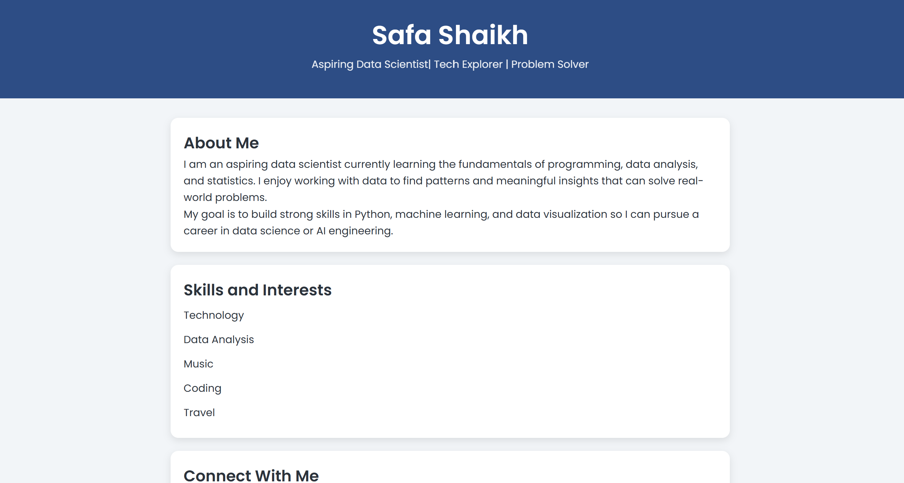

# Week 1: Personal Profile - Aspiring Data Scientist

## Project Overview
This is my first personal profile webpage built using HTML and Git.  
It showcases my learning journey toward becoming a Data Scientist.

---

## Live Website
 https://safashaikh16.github.io/hello-web/

---

## What I Learned
- How to structure a webpage using semantic HTML
- How to use lists, images, and links
- How to use Git for version control
- How to deploy a website using GitHub Pages

---

## Features
- About Me section
- Skills list (5 items)
- Workspace image
- External links (GitHub, LinkedIn, Email)
- Semantic HTML structure

---

## Links
- GitHub Repository: https://github.com/safashaikh16/hello-web
- Live Site:  https://safashaikh16.github.io/hello-web/

---

## Reflection
This project helped me understand how developers build and deploy real websites.  
I now feel more confident using HTML and Git together.

# Week 2: Hello Web - Personal Profile 

## Live Site
https://safashaikh16.github.io/hello-web/

---

## Screenshot

---

## Project Overview
This project is a personal profile page built using HTML and CSS.  
It was developed as part of my learning journey in web development and data science.

---

## Design Choices
For the styling, I used a simple and clean design approach:

- A soft blue color palette using HSL values
- Card-based layout for better readability
- Poppins Google Font for modern typography
- Hover effects on buttons for interactivity
- Consistent spacing using padding and margin

The goal was to keep the design minimal, readable, and visually balanced.

---

## What I Learned
- How to structure CSS using external stylesheets
- How to use Google Fonts
- How to apply hover transitions
- How to organize a clean layout using cards
- How to deploy updates using GitHub Pages

---

## Links
- GitHub Repository: https://github.com/safashaikh16/hello-web
- Live Site:  https://safashaikh16.github.io/hello-web/
---

## Reflection
This project helped me understand how HTML and CSS work together to create real websites.  
I also learned how Git commits track progress step-by-step and how deployment works using GitHub Pages.

# Week 3: Layout Like a Pro

## Links
- GitHub Repository: https://github.com/safashaikh16/hello-web
- Live Site:  https://safashaikh16.github.io/hello-web/

## Screenshot

## Layout Tools Used

1. Flexbox

I used Flexbox for the navigation bar because it is a one-dimensional layout that makes it easy to align items horizontally, control spacing with the gap property, and distribute content evenly.

2. CSS Grid

I used CSS Grid for the Project Gallery because it is a two-dimensional layout system that automatically adapts to different screen sizes. 

## Week 4: Go Responsive

## Screenshots:

### Mobile (375px)

### Tablet (768px)

### Desktop (1024px)

## Links
- GitHub Repository: https://github.com/safashaikh16/hello-web
- Live Site:  https://safashaikh16.github.io/hello-web/

